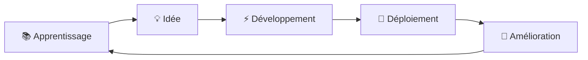

# 👋 Salut ! Je suis Ilian AKGUL

  

---

## 🚀 À propos de moi

> 🎓 **Étudiant en développement** | 💻 **Passionné de code** | 🌱 **En apprentissage continu**

Je suis un développeur étudiant motivé et curieux, toujours à la recherche de nouveaux défis techniques. Mon parcours me permet d'explorer différentes technologies et de construire des projets variés, du développement web aux applications desktop.

---

## 🛠️ Technologies & Langages

### 💻 Langages de Programmation

### 🔧 Outils & Environnements

---

## 📈 Statistiques GitHub

  
  

  

---

## 🎯 Projets en cours

### 🌟 Projets récents
- 🔹 **[Projet D&D]** - Création d'un jeu Donjon & Dragons simplifié en Java à l'aide du logiciel Intellij (Java)
- 🔹 **[Projet Caserne Pompiers]** - Création d'un logiciel de gestion de caserne de pompiers à l'aide du logiciel Visual Studio (C#, SqLite)

---

## 🎓 Apprentissage

  

### 📖 En cours d'apprentissage
- 🔸 Approfondissement des frameworks JavaScript
- 🔸 Optimisation des bases de données
- 🔸 Principes de l'architecture logicielle
- 🔸 Bonnes pratiques de développement

---

## 🤝 Collaboration

> 💬 **Ouvert aux collaborations** sur des projets étudiants et open source !
> 
> 📧 **Contact** : iliankaan@gmail.com

---

  
  
  <h3>🚀 "Le code n'est pas juste ce que nous écrivons, c'est ce que nous créons !"</h3>
  
  

