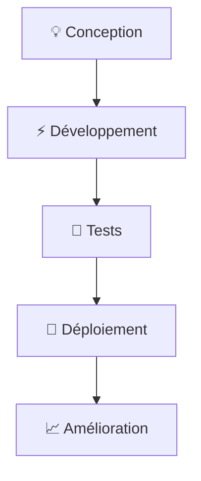

# 👋 Salut ! Je suis Ilian Akgul

  

---

## 🚀 À propos de moi

> 🎓 **BUT Informatique - IUT Robert Schuman, Université de Strasbourg** | 💻 **Développeur étudiant** | 🌱 **19 ans et passionné de code**

Je suis étudiant en BUT Informatique avec une solide expérience en programmation orientée objet et développement web. Mon parcours m'a permis d'acquérir des compétences variées, de la conception d'applications à la gestion de bases de données.

---

## 🛠️ Technologies & Langages

### 💻 Langages de Programmation

### 🔧 Outils & Environnements

📊 Détail de mes compétences

| Technologie | Domaine d'application |
|-------------|----------------------|
| **Java** | Programmation orientée objet, applications structurées |
| **C / C#** | Développement d'applications, maîtrise POO |
| **HTML/CSS/JavaScript** | Interfaces web dynamiques |
| **PHP** | Développement web backend |
| **React** | Frameworks JavaScript modernes |
| **SQL** | Modélisation et requêtes optimisées |
| **Git/GitHub** | Gestion de versions et collaboration |

**Outils spécialisés :** Visual Studio, IntelliJ IDEA, Cisco Packet Tracer, Arduino

---

## 🎯 Projets Réalisés

### 🌟 Projets académiques et personnels

- 🎮 **Donjon & Dragons** - Jeu D&D simplifié développé en Java avec IntelliJ
  - Programmation orientée objet avancée
  - Interface utilisateur intuitive
  
- 🏢 **Kalypso** - Simulation de gestion d'entreprise
  - Gestion de stratégie, production et ventes
  - Travail d'équipe et gestion de projet

- 🌐 **Projets Web** - Développement de sites web
  - HTML, CSS, JavaScript et PHP
  - Expérience acquise lors du stage en entreprise

---

## 📚 Formation & Certifications

| 🎓 Formation | 🏫 Établissement |
|--------------|------------------|
| **BUT Informatique** | IUT Robert Schuman, Université de Strasbourg |
| **Bac STI2D** | Lycée du Haut-Barr, Saverne |

### 🏆 Certifications
- 🔐 **Certification Cybersécurité** avec Cisco Packet Tracer
- ⭐ **Certification PIX** - Lycée du Haut-Barr
- 🌐 **Expérience professionnelle** - Stage de découverte (développement web, AutoCAD)

---

## 🌍 Langues

| Langue | Niveau |
|--------|--------|
| 🇫🇷 **Français** | Langue maternelle |
| 🇬🇧 **Anglais** | Bilingue |
| 🇹🇷 **Turc** | Courant |
| 🇩🇪 **Allemand** | Courant (B1) |

---

## 💼 Expérience Professionnelle

### 🔬 **Job étudiant - Laboratoire EUROFINS**
- Travail en équipe et collaboration
- Rigueur et précision dans les tâches techniques

### 🏢 **Stage de découverte - Saverne (Mai 2021)**
- Développement de sites web (HTML, JavaScript)
- Utilisation d'AutoCAD pour conception de plans
- Première approche du monde professionnel

---

## 🤝 Me Contacter

> 📍 **Localisation** : Saverne, Grand Est, France
> 
> 💬 **Ouvert aux collaborations** sur des projets étudiants et stages !

---

## 🎨 Centres d'Intérêt

| 💪 Sport | 💻 Tech | 🎯 Compétences |
|----------|---------|----------------|
| Activités sportives | Veille technologique | Gestion de projet |
| Esprit d'équipe | Nouvelles technologies | Organisation & planification |

---

  
  <h3>🚀 "Apprendre, créer, innover - Un projet à la fois !"</h3>
  
  
  

---

⚡ En savoir plus

### 🎯 Objectifs actuels
- 📈 Approfondir mes connaissances en développement web
- 🔍 Explorer de nouveaux frameworks et technologies
- 🤝 Participer à des projets collaboratifs
- 🏢 Recherche de stage pour mettre en pratique mes compétences

### 💡 Ce qui me motive
- 🧩 Résoudre des problèmes complexes
- 👥 Travailler en équipe sur des projets innovants
- 🌱 Apprentissage continu des nouvelles technologies
- 🎮 Créer des applications utiles et divertissantes

